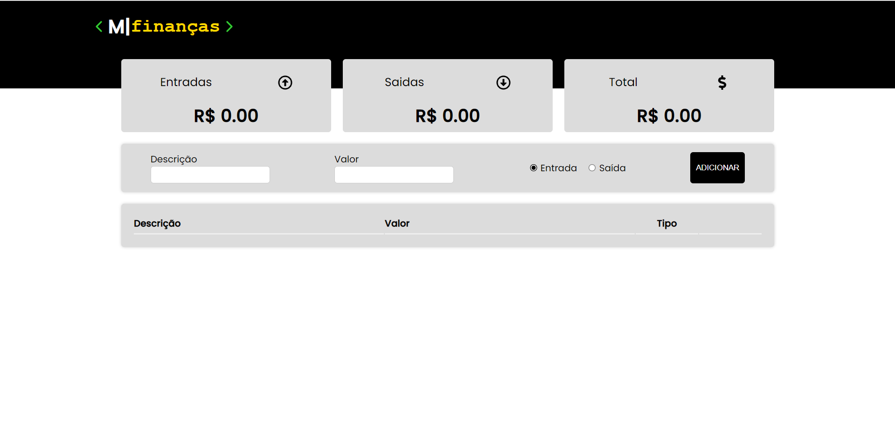

<h1> M|Finanças</h1>

Para iniciar o **APP Finanças** utilize os comandos:
```bash
yarn install
yarn start
```
Assim que o processo terminar, automaticamente será aberta no seu navegador a página `localhost:3000` contendo o Projeto.

 O Projeto foi desenvolvido com muita dedicação e ele ficou assim:
 
</img>

<h2> Objetivo </h2>

- [x] Controlar valor de entrada
- [x] Controlar valor de Saida
- [x] Mostrar o salto total
- [x] Mostrar historico de entradas e saidas de valores
- [x] Deletar historico de valor

## 🛠 Tecnologias

As seguintes ferramentas foram usadas na construção do projeto:

- [React Js](https://pt-br.reactjs.org/)
- [React icons](https://react-icons.github.io/react-icons/)
- [Styled components](https://styled-components.com/)
